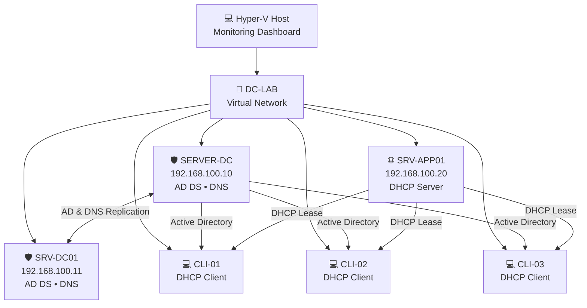
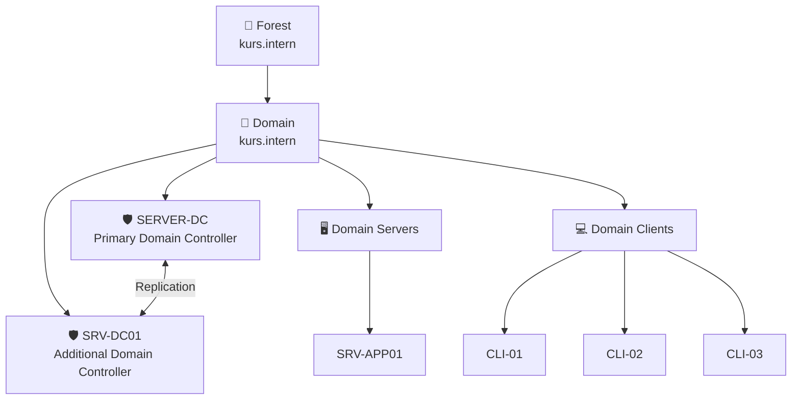
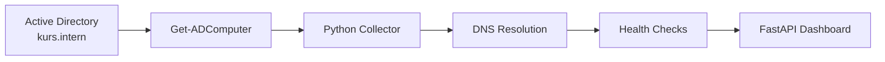
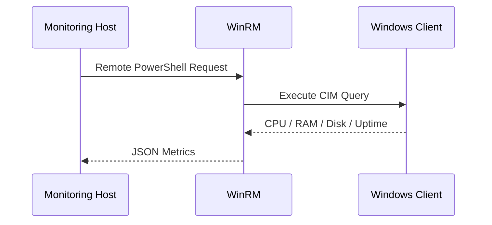
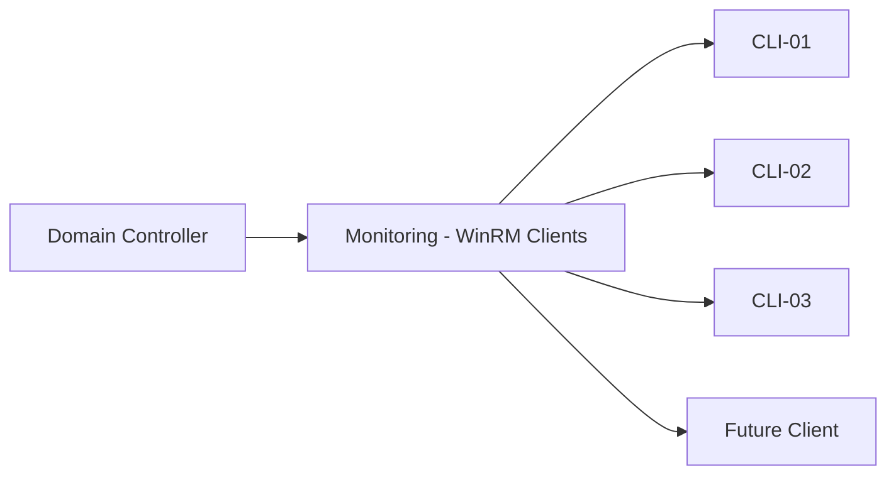

# 🖥️ Automated Hybrid Network Monitoring Dashboard

<p align="center">
  <strong>Real-Time Windows Server & Active Directory Infrastructure Monitoring</strong>
</p>

<p align="center">
  Python • FastAPI • PowerShell • WinRM • Active Directory • DNS • DHCP • Hyper-V
</p>

<p align="center">
  
  
  
  
  
</p>

---

## 🚀 Project Overview

**Automated Hybrid Network Monitoring Dashboard** is a real Windows infrastructure monitoring platform built around a Microsoft Active Directory home lab.

The platform automatically discovers domain-joined servers and clients from Active Directory and remotely monitors their health without requiring a Python agent on every machine.

The monitoring engine collects:

- 🟢 Online / Offline status
- ⚙️ CPU utilization
- 🧠 RAM utilization
- 💾 Disk usage
- ⏱️ System uptime
- 🌐 IP addresses
- 🖥️ Device type
- 🔎 Active Directory computer discovery

The dashboard is powered by **FastAPI**, while Windows telemetry is collected remotely through **PowerShell, WinRM and CIM/WMI**.

---

# 🏗️ Infrastructure Architecture



---

# 🏢 Active Directory Architecture



---

# 🌐 Lab Network

| Device | Role | IP Address |
|---|---|---|
| `Gateway` | Hyper-V NAT Gateway | `192.168.100.1` |
| `SERVER-DC` | Domain Controller + DNS | `192.168.100.10` |
| `SRV-DC01` | Additional DC + DNS | `192.168.100.11` |
| `SRV-APP01` | DHCP Server | `192.168.100.20` |
| `CLI-01` | Windows Client | DHCP |
| `CLI-02` | Windows Client | DHCP |
| `CLI-03` | Windows Client | DHCP |

### DHCP Pool

```text
192.168.100.100
        ↓
192.168.100.200
```

### DHCP Options

```text
003 Router
→ 192.168.100.1

006 DNS Servers
→ 192.168.100.10
→ 192.168.100.11

015 DNS Domain Name
→ kurs.intern
```

---

# 🔍 Automatic Active Directory Discovery

One of the main features of the project is automatic device discovery.

The monitoring system does **not** require servers or clients to be manually added to the Python source code.



When a new machine such as:

```text
CLI-04
```

joins the domain:

```text
CLI-04
   ↓
kurs.intern
   ↓
Active Directory
   ↓
Auto Discovery
   ↓
Monitoring Collector
   ↓
Dashboard
```

it can automatically become part of the monitoring environment.

---

# 📊 Current Monitoring Metrics

Each discovered device can report:

| Metric | Description |
|---|---|
| 🟢 Status | Online / Offline |
| ⚙️ CPU | Current CPU utilization |
| 🧠 RAM | Memory utilization |
| 💾 Disk | C: drive utilization |
| ⏱️ Uptime | Hours since last boot |
| 🌐 IP | Internal IP address |
| 🖥️ Role | Server, Domain Controller or Client |

Example:

```text
SERVER-DC

Status  → ONLINE
CPU     → 0.6%
RAM     → 67.5%
Disk    → 22.5%
Uptime  → 2.1 h
```

---

# ⚡ Parallel Monitoring Engine

Remote systems are checked concurrently using Python:

```text
ThreadPoolExecutor
```

Instead of:

```text
Server 1
   ↓
Server 2
   ↓
Server 3
   ↓
Client 1
   ↓
Client 2
```

the monitoring engine performs checks approximately like:

```text
          Collector
             │
     ┌───────┼────────┐
     ▼       ▼        ▼
 SERVER   SERVER    CLIENT
     │       │        │
     ▼       ▼        ▼
 Metrics  Metrics   Metrics
```

This prevents one slow or unavailable machine from freezing the entire monitoring dashboard.

Timeout protection is also implemented for remote operations.

---

# 🔐 Agentless Remote Monitoring

No Python monitoring agent is required on every Windows machine.

The platform uses:

```text
PowerShell Remoting
        +
WinRM
        +
CIM / WMI
```

to retrieve metrics remotely.



---

# 🛡️ Group Policy Automation

A dedicated Group Policy is used to prepare domain computers for monitoring.

```text
Monitoring - WinRM Clients
```

The policy is applied through Active Directory and can automatically configure PowerShell Remoting for domain clients.



This makes future devices much easier to integrate into the monitoring platform.

---

# 🔄 Domain Controller Redundancy

The lab contains two Domain Controllers.

```text
SERVER-DC
AD DS + DNS + GC
       ⇅
   Replication
       ⇅
SRV-DC01
AD DS + DNS + GC
```

Replication health has been verified using:

```powershell
repadmin /replsummary
```

**Purpose:** Displays a summary of Active Directory replication health between Domain Controllers.

DNS health can be verified using:

```powershell
dcdiag /test:dns
```

**Purpose:** Tests Active Directory DNS configuration and DNS-related Domain Controller health.

---

# 🧰 Technology Stack

### Infrastructure

- Windows Server 2025
- Windows 11 Pro
- Microsoft Hyper-V
- Active Directory Domain Services
- DNS
- DHCP
- Group Policy
- WinRM

### Backend

- Python 3.11
- FastAPI
- Uvicorn
- PowerShell
- CIM / WMI
- ThreadPoolExecutor

### Monitoring

- Active Directory Auto Discovery
- ICMP Health Checks
- WinRM Remote Monitoring
- DNS Resolution
- System Metrics Collection

---

# 📁 Project Structure

```text
Automated-Hybrid-Network-Monitoring-Dashboard/
│
├── app.py
│   └── FastAPI monitoring dashboard
│
├── collector.py
│   ├── Active Directory discovery
│   ├── DNS resolution
│   ├── Ping health checks
│   ├── WinRM monitoring
│   ├── CPU collection
│   ├── RAM collection
│   ├── Disk collection
│   └── Uptime collection
│
├── requirements.txt
│
├── .gitignore
│
└── README.md
```

---

# 🖥️ Dashboard

The current dashboard displays infrastructure status in real time.

```text
╔════════════════════════════════════════════════════════════╗
║           WINDOWS INFRASTRUCTURE MONITOR                  ║
║                    KURS.INTERN                            ║
╠════════════════════════════════════════════════════════════╣
║ TOTAL DEVICES     ONLINE       OFFLINE                    ║
║      6               6             0                      ║
╠════════════════════════════════════════════════════════════╣
║ DEVICE       ROLE                STATUS      RAM     DISK  ║
║ SERVER-DC    Domain Controller   🟢 ONLINE   67%     22%  ║
║ SRV-DC01     Domain Controller   🟢 ONLINE   62%     34%  ║
║ SRV-APP01    Server              🟢 ONLINE   60%     30%  ║
║ CLI-01       Client              🟢 ONLINE   73%     21%  ║
║ CLI-02       Client              🟢 ONLINE   78%     21%  ║
║ CLI-03       Client              🟢 ONLINE   74%     21%  ║
╚════════════════════════════════════════════════════════════╝
```

---

# ▶️ Running the Project

Install dependencies:

```bash
python -m pip install -r requirements.txt
```

**Purpose:** Installs the required Python packages.

Start the monitoring dashboard:

```bash
python -m uvicorn app:app --reload
```

**Purpose:** Starts the FastAPI development server with automatic reload.

Open:

```text
http://127.0.0.1:8000
```

API endpoint:

```text
http://127.0.0.1:8000/api/devices
```

---

# 🔐 Security

Credentials are **not stored directly inside Python source code**.

Windows credentials are protected using:

```text
Export-Clixml
+
Windows DPAPI
```

Sensitive files are excluded through:

```text
.gitignore
```

The monitoring system currently operates only inside the private infrastructure network.

Domain Controllers are **not directly exposed to the public Internet**.

---

# 🗺️ Development Roadmap

### ✅ Phase 1 — Windows Infrastructure

- [x] Hyper-V Lab
- [x] Active Directory Domain
- [x] Primary Domain Controller
- [x] Additional Domain Controller
- [x] DNS
- [x] AD Replication
- [x] DHCP
- [x] Windows Clients
- [x] Domain Join

### ✅ Phase 2 — Monitoring Core

- [x] FastAPI Dashboard
- [x] Active Directory Auto Discovery
- [x] DNS Resolution
- [x] Online / Offline Monitoring
- [x] CPU Monitoring
- [x] RAM Monitoring
- [x] Disk Monitoring
- [x] Uptime Monitoring
- [x] Parallel Health Checks
- [x] WinRM Remote Monitoring

### 🚧 Phase 3 — Windows Service Health

- [ ] Active Directory Health
- [ ] DNS Health
- [ ] Domain Controller Replication Health
- [ ] DHCP Service Health
- [ ] Domain Membership Validation

### 🚧 Phase 4 — Advanced Dashboard

- [ ] Live JavaScript Updates
- [ ] CPU / RAM History Graphs
- [ ] Infrastructure Health Score
- [ ] Warning Thresholds
- [ ] Critical Alerts
- [ ] Device Detail Pages
- [ ] Event History

### ☁️ Phase 5 — Cloud

- [ ] Public Dashboard
- [ ] Azure Deployment
- [ ] Secure Collector-to-Cloud API
- [ ] Historical Database
- [ ] Authentication
- [ ] HTTPS
- [ ] Alerting

---

# 🎯 Project Goal

The goal of this project is to build a practical monitoring platform while learning and demonstrating real-world skills in:

```text
Windows Server Administration
Active Directory
DNS
DHCP
Group Policy
PowerShell
WinRM
Python Automation
FastAPI
Infrastructure Monitoring
Hyper-V
Networking
Cloud Architecture
```

The final architecture will combine a **private Windows infrastructure lab** with a **secure public monitoring dashboard**, without exposing internal Domain Controllers or private network services directly to the Internet.

---

# 👨‍💻 Author

**Vahid Rahmani**

Cloud Engineering • Windows Server • System Administration • Python Automation

---

<p align="center">
  Built as a hands-on Windows Server, Active Directory and Infrastructure Monitoring project.
</p>