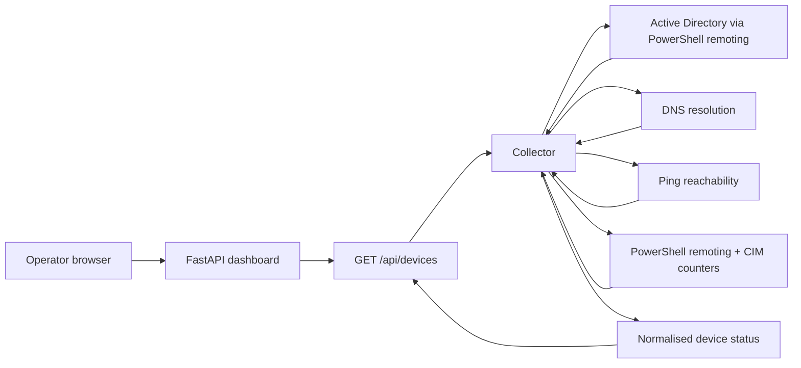

# Automated Hybrid Network & Monitoring Dashboard

> A Windows infrastructure monitoring dashboard that discovers Active Directory computers, checks reachability, and collects practical host health metrics through PowerShell remoting.

<p align="center">
  <a href="https://github.com/Vahid-Rahmani/Automated-Hybrid-Network-Monitoring-Dashboard"></a>
  <a href="https://www.python.org/"></a>
  <a href="https://fastapi.tiangolo.com/"></a>
  <a href="https://learn.microsoft.com/powershell/"></a>
</p>

## Why this project exists

Small hybrid environments often need a clear operational view before they need a large observability platform. This project provides a focused, self-hosted view of Windows machines managed through Active Directory and PowerShell remoting.

The current implementation is intentionally transparent: discovery, DNS resolution, reachability checks, remote metric collection, and dashboard rendering are all visible in a small Python codebase.

## Current capabilities

- Discovers computers from Active Directory through a domain controller.
- Resolves hostnames and checks device reachability with Windows `ping`.
- Collects CPU, RAM, C: drive usage, and uptime from online Windows hosts.
- Classifies devices as clients, servers, or domain controllers from their names.
- Runs collection concurrently with a bounded worker pool.
- Exposes a FastAPI endpoint at `/api/devices` for dashboard data.
- Serves a responsive browser dashboard from the same FastAPI application.
- Handles timeouts and unavailable hosts without stopping the whole collection cycle.

## Architecture at a glance



## Repository map

```text
.
├── app.py                 # FastAPI application and dashboard UI
├── collector.py           # AD discovery and Windows health collection
├── requirements.txt       # Runtime dependencies
├── start-monitor.bat      # Windows convenience launcher
├── templates/             # Dashboard templates
├── static/                # Dashboard assets
└── windows-infra-monitor/ # Supporting Windows infrastructure material
```

## Quick start

### Requirements

- Windows PowerShell 5.1+ or PowerShell 7
- Python 3.10+
- Network access to the domain controller and monitored Windows hosts
- A credential file created for the monitoring account at:
  `%USERPROFILE%\kurs-monitor-cred.xml`
- Permission to query Active Directory and use PowerShell remoting

### Install and run

```powershell
git clone https://github.com/Vahid-Rahmani/Automated-Hybrid-Network-Monitoring-Dashboard.git
Set-Location Automated-Hybrid-Network-Monitoring-Dashboard
py -m venv .venv
.\.venv\Scripts\Activate.ps1
py -m pip install -r requirements.txt
py -m uvicorn app:app --reload
```

Open <http://127.0.0.1:8000> in a browser. The JSON data endpoint is available at <http://127.0.0.1:8000/api/devices>.

The collector currently uses the domain controller address defined in `collector.py`. Change that value for your lab before running it.

## Credential and network notes

The collector reads an encrypted Windows credential export with PowerShell `Import-Clixml`; it does not require a password to be written in the repository. Create the file with a monitoring account on the same Windows user profile that will run the collector, and never commit it.

Before troubleshooting the application, verify:

1. DNS resolves the monitored hostnames.
2. PowerShell remoting is enabled and reachable.
3. The monitoring account has the minimum required AD and remote-query permissions.
4. Windows Firewall permits the required management traffic.

## Validation checklist

- Run the collector directly: `py collector.py`
- Start the API and open `/api/devices`.
- Confirm offline hosts remain visible with `online: false`.
- Confirm unavailable metrics are represented as `null` rather than invented values.
- Test with a lab account and lab machines before connecting production infrastructure.

## Scope and roadmap

The repository currently focuses on Windows/Active Directory discovery and host health collection. Azure-native telemetry, long-term storage, alert routing, authentication, and historical charts are planned extensions rather than claimed current features.

- [x] Active Directory discovery
- [x] Reachability and basic host metrics
- [x] FastAPI dashboard endpoint
- [ ] Authentication and role-based access
- [ ] Historical metric storage and trend charts
- [ ] Optional Azure Monitor / Log Analytics integration
- [ ] Alert policies and notification channels

## Related work

- [Vahid Rahmani portfolio](https://vahid-portfolio-three.vercel.app/)
- [GitHub profile](https://github.com/Vahid-Rahmani)
- [Zova classroom assistant](https://zovasite.vercel.app/)

## License

No license file is currently published in this repository. Review the project before reusing it in a commercial or production environment.
